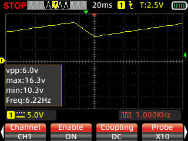

# 🛠️ Bitácora Técnica: Reparación de Cargador de Baterías 48V

Esta bitácora documenta el proceso de diagnóstico y reparación de una fuente conmutada (SMPS) de un cargador de 48V, utilizando técnicas de aislamiento y análisis de señales.

## 📋 Resumen del Estado Inicial
- **Falla:** El cargador no entrega voltaje. El LED de salida permanece apagado.
- **Observación Técnica:** El pin 7 (VCC) del IC PWM UC3842D presentaba un ciclo de "hipo" (subía a 16V y caía a 10V).
- **Seguridad:** Se trabajó con lámpara serie en 220V y alimentación externa de 17V para el IC.

---

## 📑 El Viaje del Diagnóstico (Paso a Paso)

### 1. El Osciloscopio y el Pin 7
La primera pista fue el comportamiento del voltaje de arranque. Aunque el capacitor de 47uF medía perfecto (ESR 0.00), el IC no lograba sostenerse.

### 2. Mapeo del Circuito y Bloqueo Lógico
Al alimentar el IC externamente con 17V, descubrimos que el **Pin 1 (COMP)** estaba en **0V**, lo que bloqueaba la salida (Pin 6).

- **Configuración detectada:** Pin 2 a GND. El control lo ejerce el Pin 1 a través de un transistor NPN (S8050) comandado por el secundario.

http://googleusercontent.com/image_collection/image_retrieval/9658745458938037676_0

### 3. Hallazgo del Componente Defectuoso
Al rastrear por qué el Pin 1 estaba "mudo", llegamos a los optoacopladores.
- **Medición Clave:** El fototransistor del optoacoplador de protección medía **0.019V** (Cortocircuito).
- **Efecto:** El corto activaba la base del transistor S8050, que a su vez "asfixiaba" al integrado PWM.

http://googleusercontent.com/image_collection/image_retrieval/1619224615728243968_0

### 4. Verificación del Transistor de Control
Se retiró el transistor S8050 para confirmar que el corto era del opto y no del transistor. El componente resultó estar sano.

http://googleusercontent.com/image_collection/image_retrieval/6737010969854243311_0

---

## 🔧 Resolución de la Falla
1. **Reemplazo:** Se instaló un nuevo optoacoplador PC817.
2. **Prueba de Oscilación:** Al liberar el Pin 1, apareció el diente de sierra en el Pin 4 y los pulsos en el Pin 6.
3. **Resultado Final:** Conectado a 220V con lámpara serie, el cargador entregó **50.0V estables** y encendió los LEDs de estado (AC y DC).

## 💡 Lecciones de Aprendizaje
- **No todo es el capacitor:** Aunque el VCC suba y baje, el problema puede ser un bloqueo lógico en el pin de compensación (Pin 1).
- **Configuraciones de Optos:** En fuentes de cargadores, es común encontrar un opto para regulación y otro para protección/detección de batería.
- **Seguridad primero:** La alimentación externa de 17V fue vital para medir sin riesgos.

---
*Documentación generada el 17 de Enero de 2026.*
